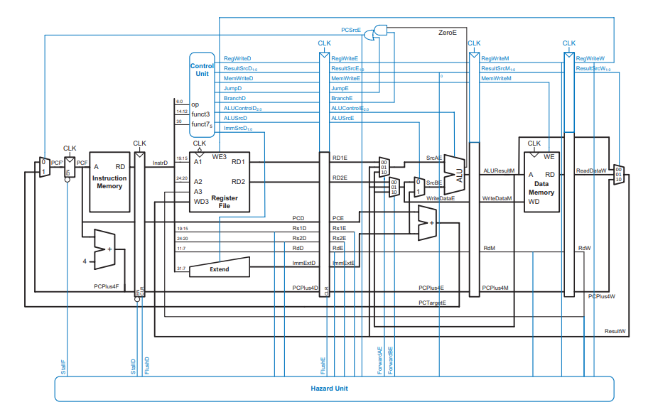
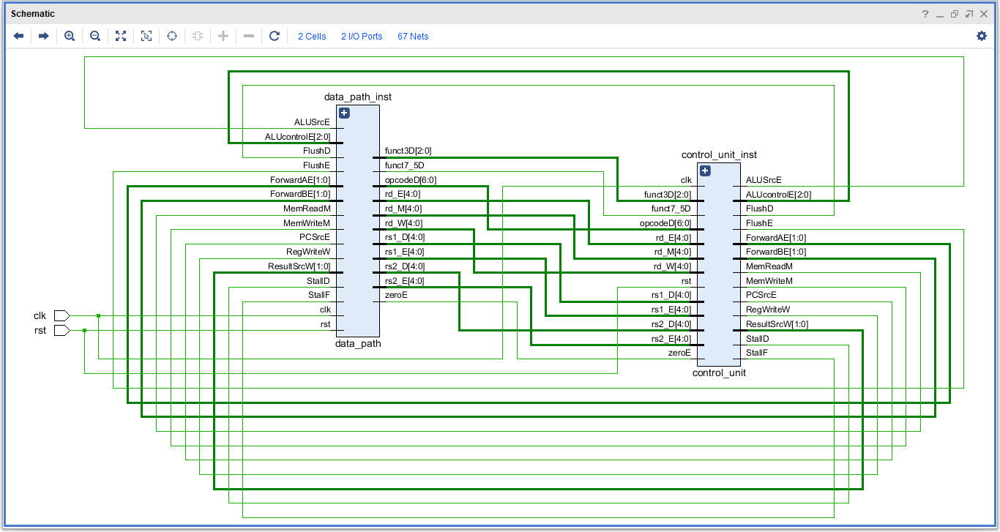
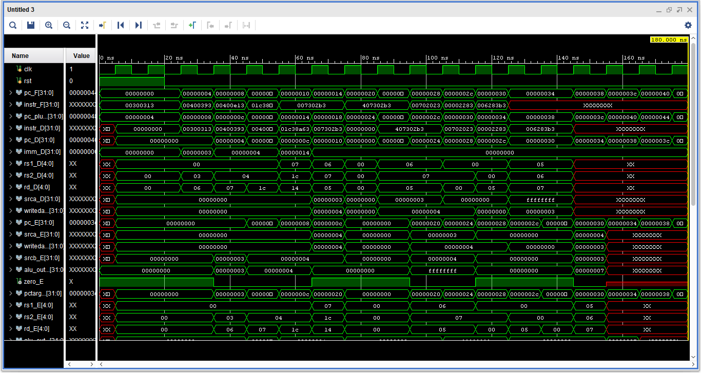
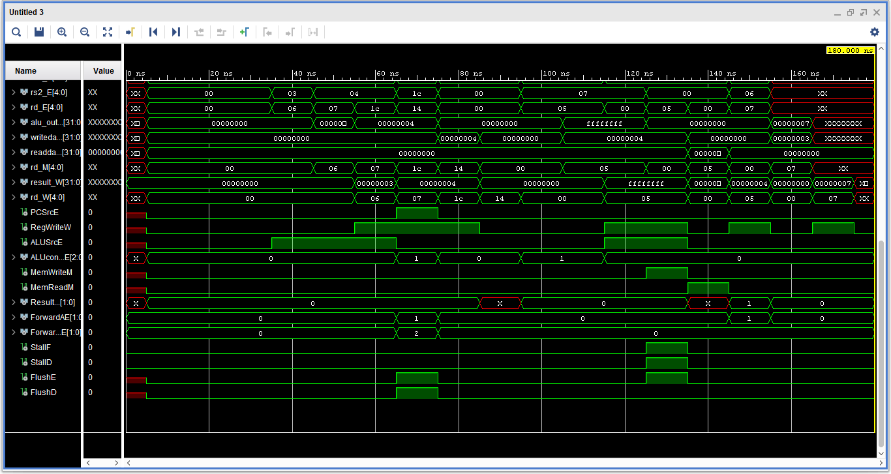
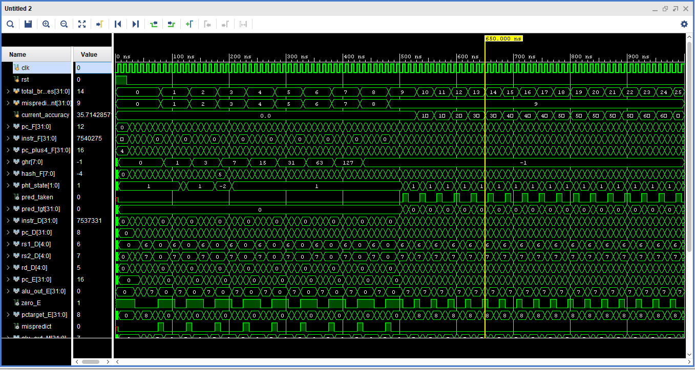
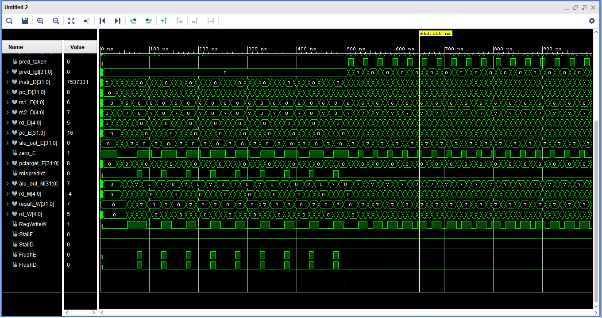

# 32-bit RISC-V Processor Core (RV32I): Single-Cycle to Pipelined Architecture

This repository contains the complete RTL design and verification of a 32-bit RISC-V processor based on the RV32I Base Integer Instruction Set. Written entirely in SystemVerilog, the project demonstrates a progressive approach to computer architecture, evolving from a foundational single-cycle datapath to a highly optimized 5-stage pipelined core with full hazard mitigation and dynamic branch prediction.

## 📌 Project Evolution & Directory Structure

The repository is structured to show the architectural evolution of the core. Each directory contains the respective SystemVerilog design files (`.sv`) and verification testbenches.

* 📂 **`01_Single_Cycle/`**
    * The foundational architecture. Executes every instruction in a single clock cycle. Focuses on datapath routing, basic control unit design, and immediate generation.
* 📂 **`02_Multi_Cycle/`**
    * Breaks instruction execution into distinct states, allowing for hardware reuse (e.g., using a single memory block for both instructions and data) and improving overall clock frequency.
* 📂 **`03_Pipelined/`** *(Main Highlight)*
    * A full 5-stage pipelined architecture (Fetch, Decode, Execute, Memory, Writeback). Features a custom integrated Hazard Unit to resolve structural, data, and control hazards dynamically without relying entirely on compiler-inserted NOPs. It also integrates an advanced Gshare Branch Predictor to minimize control hazard penalties[cite: 1].

## ⚙️ Supported Instruction Set (RV32I Base)

The processor supports core RISC-V instruction formats:
* **R-Type:** `add`, `sub`, `and`, `or`, `slt`
* **I-Type:** `addi`, `andi`, `ori`, `slti`, `lw`
* **S-Type:** `sw`
* **B-Type:** `beq`
* **J-Type:** `jal`

## 🚀 The 5-Stage Pipelined Core, Hazard Mitigation & Branch Prediction

### 🛑 Dynamic Hazard Resolution
Designing the pipelined core (`03_Pipelined`) required solving complex timing and dependency issues. A dedicated **Hazard Unit** was engineered to maintain high throughput and guarantee state correctness:

1.  **Data Forwarding (Bypassing):**
    * Detects Read-After-Write (RAW) data hazards.
    * Routes ALU results directly from the `EX/MEM` or `MEM/WB` pipeline registers back to the ALU inputs (`SrcA` and `SrcB`) in the `EX` stage, preventing unnecessary stalls.
2.  **Load-Use Stalling:**
    * Detects when an instruction requires data from a preceding `lw` instruction before the memory read is complete.
    * Dynamically stalls the `IF` and `ID` stages while flushing the `EX` stage (inserting a pipeline bubble) for one cycle, then correctly forwards the loaded data.
3.  **Control Hazard Flushing:**
    * Evaluates branches (`beq`) and jumps (`jal`) in the Execute stage.
    * If a misprediction occurs, the Hazard Unit automatically flushes the instructions incorrectly fetched in the fall-through path (`IF/ID` and `ID/EX` registers) to prevent corrupted state execution[cite: 1].

### 🧠 Gshare Branch Predictor
To further optimize pipeline throughput, the architecture implements a **Dynamic Gshare Branch Predictor** integrated directly into the Fetch and Execute stages[cite: 1].
*   **Global History Register (GHR):** Utilizes an 8-bit GHR to track the outcomes of recent branches via a shift register[cite: 1].
*   **Pattern History Table (PHT):** Implements a 256-entry table utilizing 2-bit saturating counters to evaluate whether a branch is Strongly Taken, Weakly Taken, Weakly Not Taken, or Strongly Not Taken[cite: 1].
*   **Branch Target Buffer (BTB):** Uses a 256-entry BTB with tag matching to cache and immediately supply predicted target addresses during the Fetch stage[cite: 1].
*   **Performance Tracking:** The predictor dynamically learns loop behaviors. As shown in the simulation logs, branch accuracy starts at 0% and successfully ramps up to over 95% as the saturating counters train on a backward-looping assembly sequence[cite: 2, 3].

## 🛠️ Simulation & Verification

The core was rigorously verified using custom assembly test programs loaded into the instruction memory. The testbenches simulate various hazard conditions (successive writes, load-use dependencies, and branch skipping) to ensure pipeline integrity. A dedicated testbench tracks branch execution, misprediction counts, and overall accuracy percentages in real-time[cite: 2].

**Tools:** The SystemVerilog RTL is fully synthesizable and compatible with standard EDA tools and simulators, including Vivado, Riviera-PRO, and ModelSim.

### Running a Simulation
1. Compile all `.sv` files in the desired architecture directory (e.g., `3_Pipelined_RISC_V`).
2. Run the associated testbench (`tb_RISCV_Pipelined.sv`).
3. View the generated `dump.vcd` file in your preferred waveform viewer to observe pipeline stage registers, forwarding multiplexer selections, hazard unit stall/flush signals, and branch prediction accuracy[cite: 2].

## 🤝 Author
**Muhammad Tahir Zia**
* [LinkedIn](Insert_Your_LinkedIn_URL_Here)
